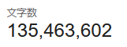

## 要約
既存知識から平均的な回答を得るだけならLLMがオンデマンドでできる。共有する必要が生じたなら、その出力を共有すればよい。したがって、人間固有の何かも、具体的な共有需要もない段階で、平均的な生成物を先回りして公共空間へ供給することは避けるべきである。

## お気持ち
人間が書いたからと言って文章に味が付くわけではないけれど、それでも、人間が書くと、それを読んだときに味がするような気がする。

LLMのせいで、読むテキストの量が増大した結果、私が、文章を読むということに対して、気が短くなったのはあると思う。それでも、昔から、テキストを読むのが苦手だったわけではないし、今でもどちらかといえば得意なほうだと思っている。
例えば、文章のフォーマットの違いはあるが、kakuyomuとかいうプラットフォームで膨大な字数のテキストを消化してきたし、これからも多分消化していくつもりだ。
また、暇な時間は、良くはないが、Twitterとdiscordを眺めて暮らしてきた。これはまじめに書くと最悪の文章だ……

さて、すべてのテキストは人間が書くべきであるという気の狂った主張を始めるのかなと思われるかもしれないが、そのようなことはない。
しかし、それでも、人間の尊厳を尊重しないような、読み手に対して、失礼な文章を投下するのはやめませんか？という話だ。
もちろん、興味がなければ読まなければよい。その通り。質の低い文章は存在が許されないのか？そのようなことを言うつもりはないが……というなかなか苦しい話だ。

それでも言いたい。なぜあなたはテキストを書くのか？あるいは、なぜ私はテキストを書くのか？私がテキストを書く理由は、もはやこれしかやることがないからである。LLMに実装をすべて任せ、GPT6 astraの登場によって、マイクロマネジメントすら人間から取り上げられた世界で、やるべきことなどほとんど残されていない。仕方がないので、こうしてつまらないテキストを書いている。LLMにもっと課金して、もっと並列実行させろ？まぁいいアイデアかもしれない。しかし、それは私のやるべきことではない何かだろう……もちろん、こんなものをつくらせられました！と驚いてみせればいいのかもしれない。思想がこもっていない、誰でも作れそうなものを作ったことに対して？そのようなことをしても、何一つ世界に貢献しないどころか、無駄にエネルギーと人々の注意を奪って、むしろマイナスである。それならまだ、こうしてつまらない文章を書いていたほうがましである。

さて、人間が書くと、それを読んだときに味がするような気がするとはどういうことだろうか？
または、味のしない文章とは何か？
今日、Xを眺めていて、とあるツイートを見た時に反射的にブロックしようとして、正しい内容が書いてあるので思いとどまったあげく、正しい内容を反射的にブロックしかけたことにショックを受けて、友人にdiscordで愚痴って(ほんとうにすいません……)、挙句にブロックするなどという私にとっては、ちょっとした事件があった。
近年のXはガラクタの中から宝石を見付ける能力を試してくるかの如く有様であり、情報量のかけらもないツイート及びリプライと、良いツイートを瞬時に見分けることができなければXを見る意味などない。Misskeyやよいdiscordサーバーを見付けろ？まぁ一理あるかもしれない。
さて、問題のツイートは技術的負債についての議論であったが、このような議論はそもそも自転車置き場の議論であることが知られているところ、この世のすべての常識人の平均をとったかのような内容が記載されていた。つまり、その発言内容自体には、何の意味もないが、正しいのである。もちろん、私が、その人に関心があったり、その人が特定の話題に対してポジションを求められているのであれば、人と内容自体を紐づけることに意味が生じるだろう。そこで、プロフィールからタイムラインを確認したところ、取り上げる話題自体には傾向がみられたものの、それぞれに対するその人のポジションや記載内容に、特別なものを私は見つけることができなかった。よって、これをブロックしようとした直感は正しかったと結論付けてブロックした。
よほどその人の視点が魅力的でない限り拾う題材に人間を見出すことはできないし、それを世界のすべてをもはや知っているLLMに通しても(LLMに通したと断定するわけではないが恐らくそうだと思う)すべてが平均化されたつまらない文章、つまり味がしない文章が生成されるだけである。

もちろん、そのような味がしないコンテンツを供給することは資源の無駄遣いという観点以外では自由である。しかし、私はそのような文章を反射で見分ける能力を手に入れてしまった(エコーチェンバーの中に入りやすくなってしまうのでかなり良くないような気がするが、それでも粗製乱造の世界ではもはや反射に頼るしかない)し、多くの人はおそらく手に入れていくことになると思う。そのような世界ですべてが平均化されたつまらない文章を書いて公開しても、誰にも評価されないし自らの学びにもならないだろうからやめて、LLMに書かせるにしても自らの体験や思想を強調して、オリジナルな、常識人の平均でない文章を基本的には書くべきだと思う。
